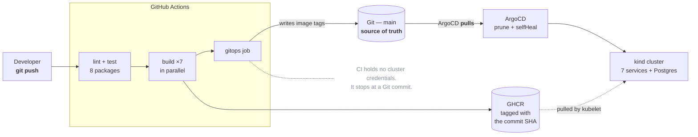
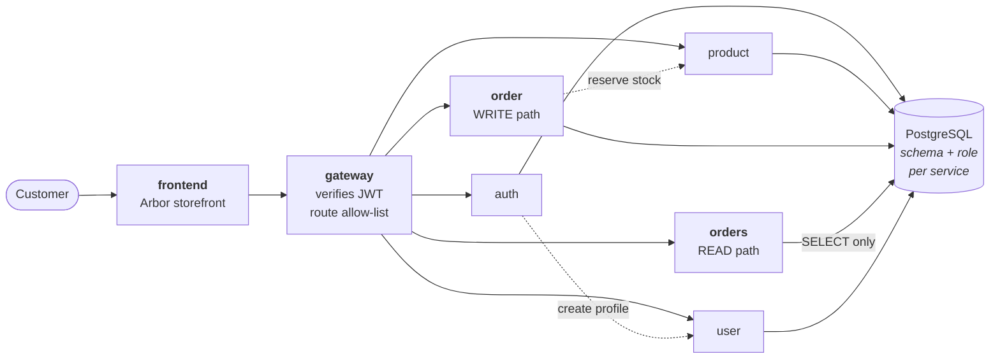
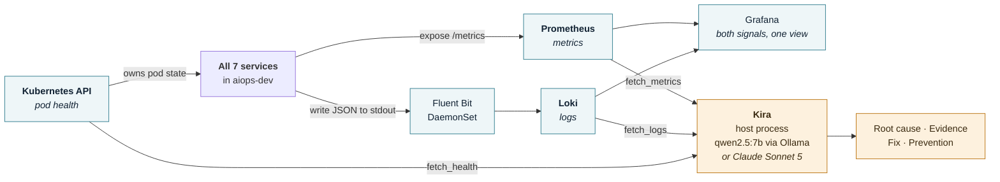

# AIOps — Three Signals

A production-shaped microservice system that builds itself, deploys itself via
GitOps, watches itself through three independent observability signals, and can
be **diagnosed** by an AI agent named **Kira**.

Kira investigates and explains. She does **not** auto-remediate — a human
applies every fix.

Everything runs on one machine. There is no cloud account, no API key required,
and no recurring cost.

| | |
|---|---|
| **Services** | 7 (Node/Express) + PostgreSQL |
| **Delivery** | GitHub Actions → GHCR → ArgoCD → kind |
| **Observability** | Prometheus (metrics), Loki (logs), Kubernetes API (health) |
| **AI** | qwen2.5:7b via Ollama, local and free — Claude Sonnet 5 optional |
| **Cost** | Zero — no cloud account, no API key |

---

## Architecture



**Request path** — the browser only ever talks to the frontend; the gateway is
the only backend entry point.



**The three signals** — a different system, a different collection path and a
different storage engine each. That independence is what makes cross-referencing
them meaningful rather than circular.



---

## Setup

### Prerequisites

| Tool | Version used | Install |
|---|---|---|
| Docker Desktop | 29.x | — |
| kind | v0.33.0 | `winget install Kubernetes.kind` |
| kubectl | v1.34.1 | `winget install Kubernetes.kubectl` |
| Terraform | 1.14.0 | `winget install Hashicorp.Terraform` |
| Node.js | v22.17.0 | — |
| Ollama | 0.34.2 | [ollama.com](https://ollama.com) — then `ollama pull qwen2.5:7b` |

**Resources: 16 GB RAM (≥8 GB to Docker) and ~12 GB free disk.** The cluster
alone is ~5.5 GB and qwen2.5:7b needs ~5 GB more. Helm is *not* required — the
Terraform provider embeds it.

### 1 — Bring up the cluster and platform

```bash
bash scripts/cluster-up.sh
```

kind creates the cluster from `infra/terraform/kind-config.yaml`; Terraform then
installs ArgoCD, kube-prometheus-stack, Loki and Fluent Bit, and plants the one
root ArgoCD Application. ArgoCD pulls everything else from `main`. Takes ~10
minutes on a cold start.

### 2 — Start the three host processes

Each in its own terminal:

```bash
# Kira's API — the dashboard's backend, reusing her three tools
cd aiops/kira && npm install && npm run server        # :7777

# Ops dashboard
cd aiops/dashboard && npm install && npm run dev      # :5173

# Ambient load, so the charts and rate windows have data
bash scripts/traffic.sh
```

### 3 — Open

| URL | What |
|---|---|
| **http://localhost:8090** | **Arbor storefront** — the customer-facing service |
| **http://localhost:5173** | **Ops dashboard** — three signals + chat with Kira |
| http://localhost:8091 | ArgoCD |
| http://localhost:3031 | Grafana (`admin` / `admin`) |
| http://localhost:9091 | Prometheus |

> Use `localhost`, not `127.0.0.1` — Vite binds IPv6.
> ArgoCD's initial password:
> `kubectl -n argocd get secret argocd-initial-admin-secret -o jsonpath='{.data.password}' | base64 -d`

### Verify

```bash
cd aiops/kira && npm run check        # model + all three data sources, by name
npm run check:tools                   # 5 tool-calling checks, no cluster needed
bash scripts/cluster-down.sh          # tear everything down
```

---

## The three critical takeaways

### 1 — GitOps is the glue

CI never deploys. Its final act is a **Git commit**: it builds seven images,
pushes them to GHCR tagged with the commit SHA, writes those tags into
`infra/k8s/overlays/dev/kustomization.yaml`, and stops. It holds no cluster
credentials — it *could not* deploy if it tried. ArgoCD, running inside the
cluster, pulls the change.

- **"What is deployed?"** is answered by reading a file, not interrogating the cluster.
- **A deploy is a `git push`; a rollback is a `git revert`.**
- `prune` + `selfHeal` make "Git is the source of truth" *enforceable*: a
  resource deleted from Git is deleted from the cluster, and a manual
  `kubectl edit` is reverted within minutes.
- **Even breaking production is a commit.** The incident toggle edits the
  manifest, commits and pushes; ArgoCD delivers the fault. Incident history is
  therefore just `git log`.

Proven by destroying the cluster entirely and rebuilding it: ArgoCD restored
all 8 workloads from Git with no manual intervention.

### 2 — Three observability layers, each independently misleading

| Signal | Source | Alone, it says |
|---|---|---|
| **Health** | Kubernetes API | "fine" — the process is up |
| **Metrics** | Prometheus | "something is wrong, somewhere" |
| **Logs** | Loki | the exact line, with no sense of scale |

The seeded incident is built to prove this. A missing shipping address throws a
`TypeError` — so **pods stay Ready throughout**, the error rate rises on
`order` *and* on `gateway`/`frontend` which merely propagate it, and only the
logs name `buildShipTo`. Any one signal alone gives the wrong answer; health
says healthy, and metrics alone point at the frontend.

### 3 — Narrow, scoped AI tools

Kira has exactly three tools, each reading exactly one system. That narrowness
is the design, not a limitation: a single `investigate()` tool returning
everything would mean the correlation happened in *our* code, not in the
model's reasoning, and the demo would prove nothing.

Two properties follow:

- **Read-only by construction.** `fetch_health` imports no write methods from
  the Kubernetes client, so "diagnose, never remediate" is enforced by the
  code, not only by the prompt.
- **The evidence is auditable.** Every tool call, its exact arguments and its
  result are streamed to the UI and written to a JSON trace. The run exits
  non-zero if all three signals were not used — so a confident answer built on
  one signal *fails* rather than passing quietly.

---

## 90-second demo script

> Have all three host processes running and the seeded fault **disarmed**.
> Pre-open both tabs.

| Time | Do | Say |
|---|---|---|
| **0:00** | Storefront at `:8090`. Add 2–3 items. | "Seven microservices behind a gateway. This catalogue is a live call to the product service — those stock numbers are real." |
| **0:15** | Open cart → **Checkout**. | "Checkout posts to the order service, which reserves stock atomically before writing the order." |
| **0:25** | Tick **"submit without a shipping address"** → **Place order**. | "A client sends a malformed order. Watch what comes back." |
| **0:35** | Point at the error box: **HTTP 500**, `internal_error`, `request_id`. | "That's the real response, not a mock. The service returns a request id rather than a stack trace — you don't leak internals to a browser." |
| **0:45** | Switch to the ops dashboard at `:5173`. | "Same system, operator's view. Order is degraded; gateway and frontend show errors too — but they're only propagating it." |
| **0:55** | Click **"Investigate the checkout errors"**. | "Kira knows nothing about this fault. She gets the same one-line complaint a user would file." |
| **1:05** | Tool calls stream in: `fetch_metrics`, `fetch_logs`, `fetch_health`. | "Three tools, three independent systems — Prometheus, Loki, the Kubernetes API. She must call all three before concluding." |
| **1:20** | Her report renders. Read the root cause line. | "`buildShipTo`, unhandled null. She names `order` as the origin and calls gateway and frontend collateral. Pods were healthy the whole time — that's why health alone would have said nothing is wrong." |
| **1:30** | **Done.** | |

**If there is time** — Grafana at `:3031` → *AIOps — Three Signals*: "the same
three signals as raw telemetry, so you can check her working." And ArgoCD at
`:8091`: "arming that fault was a Git commit; this is what delivered it."

> **Before demoing:** arm the fault from the dashboard **~2 minutes ahead** and
> leave `traffic.sh` running, so errors are inside the 15-minute rate window
> when you start. Kira on qwen2.5:7b takes **~40–50 s**, and the first call of
> the day adds ~50 s of model load — do one throwaway run first.

---

## Tool stack

| Tool | What it does | Chosen over |
|---|---|---|
| **kind** | Runs Kubernetes in Docker containers | **EKS** — removes ~$105/month; **minikube** — kind's multi-node support makes pod scheduling observable |
| **Terraform** | Installs the four platform Helm releases, pinned | **Raw `helm` CLI** — no dependency graph, no state, no idempotent `destroy` |
| **ArgoCD** | Pulls manifests from Git and reconciles the cluster | **`kubectl apply` in CI** — that gives CI cluster credentials and makes drift undetectable; **Flux** — ArgoCD's UI makes sync state visible in a demo |
| **kustomize** | Patches image tags without templating | **Helm charts for our own apps** — `kustomize edit set image` is a structurally validated edit, so a malformed manifest fails in CI rather than at sync time |
| **GitHub Actions** | Builds 7 images in parallel, writes tags back to Git | **Jenkins** — needs a server to host and secure; Actions needs no secrets at all here |
| **GHCR** | Stores images, immutable per tag | **Docker Hub** — rate limits on anonymous pulls; **ECR** — needs an AWS account and an OIDC trust policy |
| **Prometheus** (kube-prometheus-stack) | Scrapes `/metrics` from all 7 via ServiceMonitors | **Cloud monitoring** — costs money and cannot run offline |
| **Loki** | Stores logs, queried by label | **Elasticsearch** — several GB of JVM for a laptop; Loki indexes labels only |
| **Fluent Bit** | Ships container stdout to Loki | **Promtail** — end-of-life since March 2026; **Alloy** — Fluent Bit keeps the original design's shipper, changing only the output plugin |
| **Grafana** | Dashboards as code, both datasources in one view | Hand-built UI — a human must be able to check Kira's working in a tool she doesn't control |
| **Ollama + qwen2.5:7b** | Runs the agent locally, free | **Anthropic API** — costs per call and needs a key; kept as a one-line swap for when accuracy matters |
| **Anthropic SDK** | Optional `KIRA_PROVIDER=anthropic` path | — kept so "use Sonnet 5 if you have access" is actionable rather than hollow advice |
| **Node.js / Express** | All 7 services + Kira + the dashboard API | **Python/FastAPI** — one language across the whole stack means one toolchain, one CI matrix, one set of idioms |
| **PostgreSQL** | One instance, a schema + role per service | **A database per service** — the isolation that matters (a service cannot touch another's tables) is enforced by roles and grants at a fraction of the operational weight |
| **React + Vite + Tailwind** | The ops dashboard | Vanilla — the dashboard has real client state (streaming, palette, polling) that earns a framework |
| **Vanilla HTML/CSS/JS** | The storefront | **React** — the frontend service is a plain Express static server; a build step would complicate its Dockerfile and CI for one page |

---

## Known limitations

### 1 — Kira diagnoses; she does not remediate

By design. She returns a root cause, the evidence behind it, a recommended fix
and a prevention suggestion — a human decides and acts. This is enforced in
three places, not just requested in the prompt: `fetch_health` imports no write
methods from the Kubernetes client; her system prompt forbids recommending
state-changing commands; and the system deploys via GitOps, so the fix is a
reviewed commit rather than a command anyone could run.

An auto-remediating agent would also be much harder to defend: it would need to
be *right* rather than merely *useful*, and a wrong automated action on a
partial failure makes an incident worse.

### 2 — qwen2.5:7b is measurably less reliable than Sonnet 5

The local model identifies the root cause correctly and consistently, but it
makes factual slips inside an otherwise sound diagnosis. The reproducible one:
**it lists `orders` as affected when `orders` had zero errors**, confusing the
similarly-named `order` (write path) and `orders` (read path).

A prompt note now disambiguates them, and the tools return `by_service`
breakdowns that name services explicitly — but the underlying weakness is the
model's, not the plumbing's. It is good enough to demonstrate the architecture;
it is **not good enough to trust unreviewed**.

`KIRA_PROVIDER=anthropic ANTHROPIC_API_KEY=… npm start` switches to
`claude-sonnet-5` (~$0.12/diagnosis) — only the model client changes.

### 3 — Two writers to `main`, one safety mechanism

Both CI's `gitops` job and the dashboard's incident toggle commit to `main`.
That is a shared mutable resource with two concurrent writers, and the collision
is routine rather than rare: CI commits an image-tag bump after **every** build,
so any other clone goes stale within minutes.

CI had rebase-and-retry from the start. The dashboard toggle did not — and it
failed the first time it ran after a CI build, with
*"Updates were rejected because a pushed branch tip is behind its remote counterpart"*.
Both paths now share the same logic: fetch, rebase, retry up to three times,
**never force-push** (a force push would discard the bot's tag bump and strand
the cluster on an image tag no longer in Git).

It works, but it is a mitigation rather than a fix. A production system would
put manifests in a **separate repository** so application `main` could stay
fully protected and the two writers would never contend at all.

### Other honest gaps

- **Per-service unit tests are placeholders.** Real coverage is `services/_shared`
  (where the logic all 7 depend on lives) plus `scripts/smoke.sh`, which tests
  through real HTTP contracts. Per-service tests need a test database or
  repository mocking.
- **Secrets are committed** as plain manifests — the same throwaway credentials
  already in `docker-compose.yml`, guarding a disposable local cluster. Production
  wants External Secrets or Sealed Secrets.
- **Application data does not survive a rebuild.** Configuration does, because it
  is in Git; the Postgres PVC goes with the cluster.
- **Only one replica per service**, to fit on a laptop.

---

## The pattern behind most of the bugs

Nearly every serious defect in this project shared one shape: **a system
confidently reporting success while doing nothing real.** In Phase 1 the seeded
bug produced a container that stayed `Ready` and passed every health check while
returning 500s to users. In Phase 4 ArgoCD reported `Synced / Healthy` with all
8 pods `Running` while the storefront was completely unreachable, because a
NodePort the kind config mapped to did not exist. In Phase 5 the agent returned
a fully-formed, plausible, correctly-formatted diagnosis — naming the right
function and the right error — having made **zero tool calls**, because the
answer had leaked into the system prompt's own example. In Phase 6 the incident
toggle reported *"already in the target state"* and moved on, when in fact a
CRLF line ending meant its pattern had never matched and the cluster was
untouched. None of these announced themselves; every one looked like success
from the outside, and each was caught only by checking the thing itself rather
than the status of the thing — querying the actual cluster instead of the UI,
asserting on the rendered page instead of the build output, testing whether the
enforcement path *fires* instead of whether the code reads correctly. The
practical lesson is that a green status is a claim, not evidence, and the
distance between them is exactly where the expensive bugs live.

## The design lesson from the storefront build

Concurrency-safety has to be applied **everywhere a shared resource is written
to, not just where the problem was first noticed.** When CI's `gitops` job was
built, the race was obvious — several jobs could finish near-simultaneously and
collide on `main` — so it got rebase-and-retry, a documented comment and a
deliberate refusal to force-push. Months of work later the dashboard's incident
toggle became a *second* writer to that same branch, and it got none of that,
because it did not look like a concurrency problem: it is a single button, a
person presses it once. But the contention was never between two humans; it was
between the human and the bot that commits after every build, which made the
collision near-certain rather than unlikely. The mistake was reasoning about the
writer in isolation instead of about the resource: the moment `main` had two
writers, every path to it inherited the same requirement, regardless of how
unlikely a collision looked from the new path's point of view.

---

## Repository layout

```
services/              7 Node/Express services + _shared observability layer
  frontend/public/     Arbor storefront (vanilla HTML/CSS/JS)
db/init/               schema, roles, grants, catalogue — one canonical copy
infra/
  terraform/           kind config + the 4 platform Helm releases
  k8s/base/            Deployments, Services, ServiceMonitors, dashboard
  k8s/overlays/dev/    image tags — the file CI writes and ArgoCD reads
  k8s/argocd/          the root Application and its children
aiops/
  kira/                the agent, its 3 tools, the dashboard API
  dashboard/           React ops dashboard
scripts/               cluster-up, cluster-down, smoke, traffic
docs/
  engineering-notes.md the full build log: decisions, bugs, verification
  design-notes/        the original AWS design, superseded and kept
```

**Further reading:** [Engineering notes](docs/engineering-notes.md) ·
[Kira](aiops/kira/README.md) · [Dashboard](aiops/dashboard/README.md) ·
[Original AWS design](docs/design-notes/original-aws-design.md)
